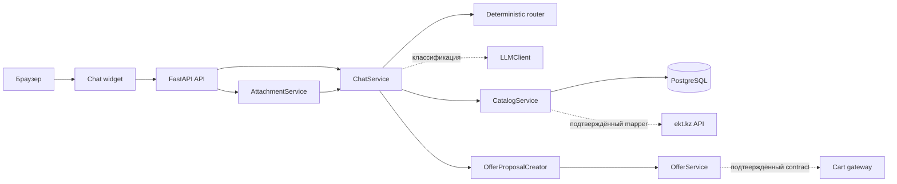
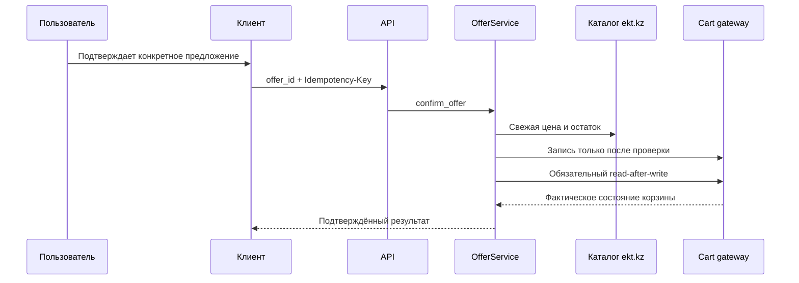

<div align="center">

# ekt.kz Product Assistant

### Безопасный MVP AI-ассистента для товарного каталога

<p>
  
  
  
  
</p>

<p>
  <a href="#быстрый-старт">Быстрый старт</a> ·
  <a href="#возможности">Возможности</a> ·
  <a href="#статус-интеграций">Статус интеграций</a> ·
  <a href="#документация">Документация</a>
</p>

</div>

> [!IMPORTANT]
> Это фундамент MVP, а не имитация интеграции с ekt.kz. В репозитории нет синтетического каталога, фиктивной корзины или вымышленных условий покупки. Пока партнёр не подтвердит контракт, соответствующие операции безопасно возвращают состояние `unavailable`.

## Что это такое

**ekt.kz Product Assistant** — серверная основа для чат-виджета товарного каталога. Она изолирует LLM от фактов и операций изменения состояния: модель может только классифицировать сообщение, а поиск, актуальные сведения о товаре и подтверждение корзины выполняются контролируемыми backend-сервисами.

Проект удобно использовать как отправную точку для интеграции с реальным каталогом ekt.kz: границы адаптеров, внутренняя модель товара, сессии, вложения, pending offers и ошибки уже определены и протестированы.

## Возможности

| | Возможность | Как это устроено |
| --- | --- | --- |
| 💬 | Сессионный диалог | История изолирована по chat session; follow-up вопрос использует только контекст своей сессии. |
| 🔎 | Каталог и поиск | Точный SKU имеет приоритет над текстовым поиском; индекс PostgreSQL поддерживает FTS и JSONB-характеристики. |
| 🧭 | Grounded-ответы | Факты о товаре поступают только через `CatalogService`, а не из LLM prompt. |
| 📎 | Вложения | PDF, DOCX, XLSX, JPEG и PNG проходят проверку формата и извлечение данных; бинарные файлы не передаются модели. |
| 🛒 | Безопасный pending offer | Изменение корзины требует отдельного `offer_id`, явного подтверждения, свежей проверки и ключа идемпотентности. |
| 🔌 | Заменяемые интеграции | Catalog, LLM, cart, правила аналогов и условия покупки вынесены в независимые service/adapter boundaries. |

## Статус интеграций

| Компонент | Сейчас | Что нужно для включения |
| --- | --- | --- |
| Каталог ekt.kz | 🟡 Граница адаптера и Basic Auth клиент готовы, runtime использует `UnavailableCatalogAdapter`. | Подтверждённые JSON-схемы, пагинация и реализация `EktResponseMapper`. |
| Поиск | 🟡 Локальный PostgreSQL-индекс и API готовы; без загруженного подтверждённого каталога поиск пуст. | Источник и процесс загрузки нормализованных товаров. |
| LLM | 🟢 Provider-neutral интерфейс и OpenAI-compatible HTTP adapter готовы. | Server-side URL, key и имя модели в `.env`. |
| Корзина | 🔴 Запись намеренно отключена через `UnavailableCartGateway`. | Контракт ownership, read/write, idempotency и cart URL от партнёра. |
| Аналоги | 🟡 Архитектура compatibility-first готова и fail-closed. | Утверждённые профили взаимозаменяемости по категориям. |
| Условия покупки | 🔴 Не сообщаются как факты без утверждённого источника. | Проверяемый источник оплаты, доставки, MOQ и прочих правил. |

<details>
<summary><strong>Почему это важно?</strong></summary>

Семантическое сходство не означает совместимость, а правдоподобный текст LLM не является данными каталога. Поэтому неизвестные сведения не заполняются предположениями: отсутствие поля, `null`, `0` и пустой список остаются различимыми во внутренней модели.

</details>

## Архитектура



Ключевая граница: `CatalogService` — единственная точка доступа к товарным данным для routes и чата. Внешний JSON не выходит за пределы adapter layer, а cached-поля не выдаются за актуальные цену, остатки или доступность.

## Быстрый старт

### Docker Compose — рекомендуемый путь

```bash
cp .env.example .env
docker compose up --build
```

После старта:

| Сервис | Адрес |
| --- | --- |
| Чат-виджет | [http://localhost:8080](http://localhost:8080) |
| Swagger UI | [http://localhost:8000/docs](http://localhost:8000/docs) |
| Healthcheck | [http://localhost:8000/health](http://localhost:8000/health) |

```bash
curl http://localhost:8000/health
# {"status":"ok","database":"ok"}
```

Остановить контейнеры:

```bash
docker compose down
```

Для удаления локальных данных PostgreSQL используйте `docker compose down -v`.

> [!NOTE]
> Compose поднимает `db`, `api` и `widget`, а API применяет Alembic-миграции до запуска. Виджет и API доступны сразу, но товарные ответы требуют подтверждённого catalog mapper и данных источника.

<details>
<summary><strong>Запуск без Docker</strong></summary>

Требуются Python 3.12, PostgreSQL 16 и Tesseract OCR для JPEG/PNG.

```bash
cp .env.example .env
python -m venv .venv
source .venv/bin/activate
pip install -r requirements.txt
alembic upgrade head
uvicorn app.main:app --reload
```

API будет доступен на `http://127.0.0.1:8000`.

</details>

## Безопасность по умолчанию



- **LLM не получает tools, доступ к БД, ekt.kz, корзине или секретам.** Он возвращает только валидируемую структурированную классификацию.
- **Корзина не изменяется по текстовому «да».** Нужны конкретный `offer_id`, та же сессия, fresh validation и `Idempotency-Key`.
- **Внешние ошибки не раскрываются клиенту.** Все ожидаемые ошибки имеют форму `{ "code", "message" }`.
- **Credentials остаются на сервере.** `.env` игнорируется Git; Basic Auth, API keys, URL с секретами и request bodies не попадают в логи.
- **Вложения недоверенны.** Сервис проверяет размер, расширение, MIME и содержимое; в LLM передаётся лишь ограниченный нормализованный текст.

Подробности: [security review](docs/security-review.md) · [контракт ошибок](docs/api-conventions.md) · [подтверждение корзины](docs/offer-confirmation-flow.md).

## API: краткая карта

Полная интерактивная спецификация доступна в [Swagger UI](http://localhost:8000/docs) после локального запуска.

| Область | Основные endpoints | Назначение |
| --- | --- | --- |
| Health | `GET /health` | Проверка доступности API и PostgreSQL. |
| Чат | `POST /api/chat/sessions`<br>`POST /api/chat/sessions/{id}/messages`<br>`GET /api/chat/sessions/{id}/messages` | Создание сессии, сообщение и история. |
| Каталог | `GET /api/catalog/search`<br>`GET /api/catalog/products/{article}/fresh`<br>`GET /api/catalog/products/{article}/current` | Поиск и актуализация данных через каталоговый сервис. |
| Вложения | `POST /api/attachments`<br>`POST /api/chat/sessions/{id}/attachments` | Извлечение или session-scoped загрузка. |
| Offers | `POST /api/chat/sessions/{id}/offers`<br>`POST /api/chat/sessions/{id}/offers/{offer_id}/confirm` | Создание и безопасное подтверждение предложения. |

> [!WARNING]
> Наличие endpoints не означает наличие production-интеграции. Catalog и cart вызовы выполняются только после подключения подтверждённых adapter contracts; до этого они fail closed.

## Подключение ekt.kz

Сервис не угадывает API партнёра. На данный момент документированы только следующие read-пути:

```text
GET /api/products?page=<number>
GET /api/products/detail?id=<partner-id>
```

После получения актуальной документации от партнёра:

1. Реализуйте и проверьте `EktResponseMapper` по фактической JSON-схеме.
2. Сохраните семантику отсутствующих полей через `source_field_presence` — не подставляйте значения по умолчанию.
3. Подключите mapper к `EktCatalogAdapter` и реализуйте контролируемый процесс обновления индекса.
4. Подтвердите отдельный cart contract до реализации gateway: cart owner, read/write, идемпотентность и URL корзины.
5. Добавьте утверждённые правила аналогов и источник условий покупки в соответствующие configuration/service boundaries.

Credentials задаются только через environment variables (`EKT_API_USERNAME`, `EKT_API_PASSWORD`) и никогда не должны попадать в исходный код или browser.

Подробнее: [интеграция ekt.kz](docs/ekt-integration.md) · [каталог и поиск](docs/catalog.md).

## Структура проекта

```text
.
├── app/
│   ├── api/routes/       # FastAPI endpoints
│   ├── config/           # settings, database, logging, reviewable config
│   ├── integrations/     # EKT, LLM и cart boundaries
│   ├── models/           # SQLAlchemy entities
│   ├── repositories/     # persistence queries
│   ├── schemas/          # Pydantic contracts
│   └── services/         # chat, catalog, offers, attachments, analogs
├── alembic/              # database migrations
├── docs/                 # architecture and integration contracts
├── tests/                # unit and integration tests
├── widget/               # static chat widget + Nginx proxy
├── docker-compose.yml
└── .env.example
```

## Разработка и качество

```bash
# Автотесты
pytest -q

# Проверка импорта/синтаксиса Python
python -m compileall -q app

# Применить миграции
alembic upgrade head

# Очистить временные данные (в production запускается scheduler платформы)
python -m app.maintenance
```

`PendingOffer`, idempotency keys и нормализованные данные вложений имеют срок жизни. Команда maintenance удаляет истёкшие записи bounded batches; встроенный scheduler намеренно отсутствует.

Ключевые настройки и безопасные значения по умолчанию находятся в [`.env.example`](.env.example). Реальный `.env` не коммитится.

## Документация

| Тема | Документ |
| --- | --- |
| HTTP-формат и ошибки | [API conventions](docs/api-conventions.md) |
| Каталог, поиск и fresh data | [Catalog](docs/catalog.md) |
| Диалог и LLM isolation | [Chat flow](docs/chat-flow.md) |
| Аналоги и compatibility filters | [Analog replacements](docs/analog-replacements.md) |
| Pending offer и подтверждение | [Offer confirmation flow](docs/offer-confirmation-flow.md) |
| Загрузка и разбор файлов | [Attachments](docs/attachments.md) · [Chat attachments](docs/chat-attachments.md) |
| Условия покупки | [Purchase conditions](docs/purchase-conditions.md) |
| Контракт EKT | [EKT integration](docs/ekt-integration.md) |
| Безопасность | [Security review](docs/security-review.md) |

---

<div align="center">
  <sub>Собрано для безопасного поэтапного подключения реального каталога ekt.kz.</sub>
</div>
