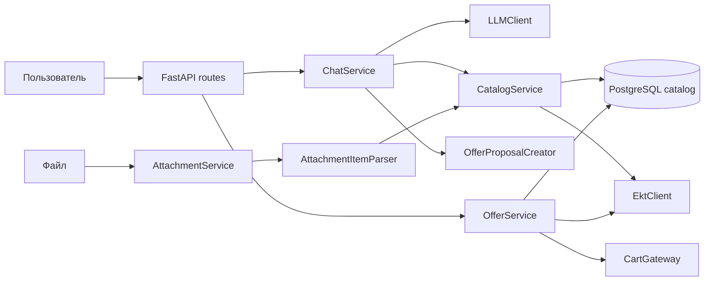

# ekt.kz Product Assistant Prototype

Прототип состоит из браузерного чат-виджета и backend MVP для подбора товаров: Python 3.12, FastAPI, Pydantic, PostgreSQL, SQLAlchemy и Alembic. EKT, LLM и обработка файлов изолированы в серверных адаптерах.

## Архитектура

- `app/api/routes` — HTTP endpoints.
- `app/schemas` — Pydantic-схемы запросов и ответов.
- `app/models` — SQLAlchemy-модели.
- `app/repositories` — доступ к данным.
- `app/services` — ошибки и прикладная логика.
- `app/integrations` — внешние адаптеры; `ekt_client.py` изолирует HTTP API ekt.kz.
- `app/config` — настройки и подключение к PostgreSQL.
- `alembic` — миграции схемы.
- `widget` — статический browser chat widget; Nginx проксирует его `/api`-запросы к backend.
- `api` — API boundary и HTTP-документация; исполняемый Python-пакет остаётся в `app`, чтобы не ломать существующую архитектуру.

Каталог хранит характеристики в PostgreSQL `JSONB`, имеет уникальный индексированный артикул и полнотекстовый `tsvector` с GIN-индексом. Триггер PostgreSQL обновляет поисковый вектор при изменении товара. Временные предложения и ключи идемпотентности имеют `created_at`, `expires_at` и индексы истечения срока для последующей очистки.



## Требования

- Docker Engine с Compose v2 для демонстрации; или Python 3.12 и PostgreSQL 16 для локального запуска.
- Tesseract OCR для JPEG/PNG; Docker image уже содержит движок и English language data.
- Реальные credentials EKT, LLM и cart contract нужны только для подключения внешних сервисов.

## Запуск локально

Скопируйте пример настроек и при необходимости измените значения:

```bash
cp .env.example .env
```

Запустите PostgreSQL локально, затем установите зависимости и примените миграции:

```bash
python -m venv .venv
source .venv/bin/activate
pip install -r requirements.txt
alembic upgrade head
uvicorn app.main:app --reload
```

Swagger UI: <http://127.0.0.1:8000/docs>; проверка состояния: <http://127.0.0.1:8000/health>.

## Docker Compose

Одной командой запускаются API и PostgreSQL. Compose автоматически применяет миграции перед запуском API:

```bash
cp .env.example .env
docker compose up --build
```

Виджет: <http://127.0.0.1:8080>. Он создаёт chat session и отправляет сообщение в `POST /api/chat/sessions/{session_id}/messages`; при отсутствии LLM backend возвращает безопасный ответ-запрос уточнения. API доступен на <http://127.0.0.1:8000>.

Остановка контейнеров:

```bash
docker compose down
```

Чтобы также удалить данные PostgreSQL, используйте `docker compose down -v`.

Проверка после старта:

```bash
curl http://localhost:8000/health
```

## Миграции

```bash
alembic upgrade head
alembic revision --autogenerate -m "describe schema change"
alembic downgrade -1
```

Для миграций локально необходим доступный PostgreSQL. `DATABASE_URL` задаётся в `.env`; не коммитьте `.env` и реальные пароли.

## Тесты

```bash
pytest
```

Тесты health endpoint и моделей не требуют работающего PostgreSQL. Интеграционный health-check можно выполнить при запущенной базе через `curl http://localhost:8000/health`.

## Переменные окружения

| Переменная | Назначение | По умолчанию |
| --- | --- | --- |
| `APP_NAME` | Имя API | `Chat Service API` |
| `APP_ENV` | Окружение | `development` |
| `LOG_LEVEL` | Уровень логирования | `INFO` |
| `DATABASE_URL` | SQLAlchemy DSN | Локальный PostgreSQL `chat` |
| `WIDGET_ORIGIN` | Разрешённый browser origin для CORS | `http://localhost:8080` |
| `POSTGRES_DB` | Имя базы в Compose | `chat` |
| `POSTGRES_USER` | Пользователь в Compose | `chat` |
| `POSTGRES_PASSWORD` | Пароль в Compose | обязателен в `.env` |
| `API_PORT` | Порт API на хосте | `8000` |
| `EKT_API_BASE_URL` | Базовый URL API ekt.kz | `https://ekt.kz/api/` |
| `EKT_API_USERNAME` | Basic Auth логин, только сервер | не задан |
| `EKT_API_PASSWORD` | Basic Auth пароль, только сервер | не задан |
| `EKT_READ_RETRY_COUNT` | Число повторов безопасных EKT GET | `1` |
| `EKT_RETRY_BACKOFF_SECONDS` | Базовая задержка между GET retry | `0.05` |
| `LLM_API_URL` | URL OpenAI-compatible LLM endpoint, только сервер | не задан |
| `LLM_API_KEY` | API key LLM, только сервер | не задан |
| `LLM_MODEL` | Имя модели | не задан |
| `LLM_HISTORY_MESSAGE_LIMIT` | Максимум сообщений, передаваемых LLM | `12` |
| `PENDING_OFFER_TTL_SECONDS` | Срок явного подтверждения предложения | `300` |
| `IDEMPOTENCY_KEY_TTL_SECONDS` | Срок хранения результата подтверждения | `86400` |
| `ATTACHMENT_MAX_BYTES` | Максимальный размер загрузки | `10485760` |
| `ATTACHMENT_LLM_MAX_CHARS` | Общий лимит извлечённого текста для LLM | `12000` |
| `ATTACHMENT_TTL_SECONDS` | Срок хранения нормализованных attachment-данных | `86400` |
| `CLEANUP_BATCH_SIZE` | Максимум записей каждого типа за один cleanup run | `1000` |

Compose defaults предназначены для локальной разработки. Для общего/боевого окружения задайте собственный пароль через некоммитящийся `.env` или секреты платформы.

## Интеграция ekt.kz

`EktClient` находится в `app/integrations/ekt_client.py`. Credentials `EKT_API_USERNAME` и `EKT_API_PASSWORD` читаются только сервером из environment/`.env`; Compose не отправляет Basic Auth в браузер. Известные GET-пути описаны в `docs/ekt-integration.md`. Формат JSON неизвестен, поэтому runtime использует `UnavailableCatalogAdapter` до реализации подтверждённого `EktResponseMapper`. Корзина не подключена: endpoints корзины в материалах не найдены.

Логи приложения выводятся как JSON. Ошибки EKT содержат только тип события, операцию, HTTP-статус и тип исключения; Basic Auth, тела запросов и ответов не логируются.

## Каталог и поиск

`CatalogService` использует один `CatalogAdapter` и скрывает от API/чата как SQLAlchemy, так и источник данных. Локальный PostgreSQL — заменяемый поисковый индекс. Пока EKT JSON mapper не подтверждён, runtime использует `UnavailableCatalogAdapter`, а поиск по не загруженному каталогу возвращает пустой результат. Точный SKU имеет приоритет; неизвестный SKU не превращается в похожий товар. Обычный текст ищется по названию, категории, описанию, бренду, характеристикам и релевантным source fields через PostgreSQL FTS, а фильтр `characteristics` работает через JSONB containment.

Локальные `cached_price`, `cached_stock_by_location` и `cached_available` не подтверждают актуальное состояние. Для изменяемых сведений используйте `CatalogService.get_fresh_product(article)` или `get_current_availability(article)`: они обращаются к adapter и не подставляют локальный cache при ошибке источника. Полный контракт и endpoints: [docs/catalog.md](docs/catalog.md).

Подбор аналогов вынесен в `AnalogService`: сначала свежие карточки проходят fail-closed compatibility filters по категории и обязательным техническим параметрам, затем оставшиеся кандидаты ранжируются по совпадениям и названию. Похожее название само по себе не является заменой. Пока партнёр не утвердил правила, `UnavailableCompatibilityRules` не предлагает аналоги. Необходимые production-критерии и формат explanation описаны в [docs/analog-replacements.md](docs/analog-replacements.md).

Внутренняя модель включает артикул, название, категорию, характеристики, кэшированные остатки по складам, цену, доступность, сертификаты и `source_fields` для дополнительных нормализованных полей. `source_field_presence` различает отсутствие ключа в источнике и переданное значение `null`/`0`/`[]`.

## Чат и LLM

API чата создаёт сессии, сохраняет user/assistant сообщения и выдаёт историю:

- `POST /api/chat/sessions`
- `POST /api/chat/sessions/{session_id}/messages`
- `GET /api/chat/sessions/{session_id}/messages`

`ChatService` зависит от абстрактного `LLMClient`, а текущая реализация использует настраиваемый OpenAI-compatible HTTP endpoint без SDK. Модель выдаёт валидируемый Pydantic structured output, но не получает доступ к PostgreSQL, ekt.kz или корзине. Для cart intent сервер может создать только `pending_offer` по своей свежей карточке и количеству; у LLM нет cart gateway или confirm-operation. Корзина не изменяется ни при каком ответе LLM. Лимит истории и необходимые environment variables приведены в [docs/chat-flow.md](docs/chat-flow.md).

Диалог хранит историю строго внутри `chat session`. Детерминированный router обрабатывает SKU, характеристики, наличие, сертификаты, цены, аналоги и условия покупки; для свободного текста LLM остаётся только provider-isolated классификатором. Любые факты о товаре берутся исключительно из `CatalogService`: свежие сертификаты/характеристики — через adapter details, наличие/цена — через current availability. Аналоги дополнительно проходят `AnalogService` compatibility filters до ranking. Несколько кандидатов вызывают уточнение, а не автоматический выбор. [Условия покупки](docs/purchase-conditions.md) читаются из отдельного reviewable provider; до утверждённого источника они возвращаются как недоступные.

## Подтверждение корзины

Предложение создаётся через `POST /api/chat/sessions/{session_id}/offers`, а подтверждение требует конкретный `offer_id` и `Idempotency-Key` в `POST /api/chat/sessions/{session_id}/offers/{offer_id}/confirm`. Сервис блокирует предложение в транзакции, повторно проверяет EKT и выполняет cart write только при неизменных цене и остатке. После write он обязательно читает корзину и подтверждает результат только по фактической позиции/количеству. При смене цены создаётся новый offer; при недоступности EKT, недостатке остатка, ошибке корзины или несоответствии read-back запись не считается успешной. Пока cart contract не получен, runtime gateway явно недоступен. Полный transaction flow: [docs/offer-confirmation-flow.md](docs/offer-confirmation-flow.md).

## Вложения

`POST /api/attachments` принимает PDF, DOCX, XLSX, JPEG/JPG и PNG и возвращает нормализованный текст, таблицы, warnings и metadata. Формат проверяется по расширению, MIME type и фактическому содержимому. PDF обрабатывается `pypdf`, DOCX — `python-docx`, XLSX — `openpyxl` в read-only режиме, изображения — Tesseract OCR.

Для чата используйте `POST /api/chat/sessions/{session_id}/attachments`, затем добавьте полученные `id` в `attachment_ids` при вызове `POST /api/chat/sessions/{session_id}/messages`. Бинарные файлы не попадают в LLM: в модель передаётся только ограниченный извлечённый текст как недоверенные данные. Позиции из текста и таблиц ищутся через `CatalogService`, а для единственного совпадения цена, остаток и доступность проверяются через EKT. Корзина по вложению не меняется автоматически; требуется существующий `PendingOffer` и явное подтверждение. Полный flow: [docs/chat-attachments.md](docs/chat-attachments.md).

## Очистка временных данных

Нормализованные вложения, expired offers и idempotency keys удаляются командой без дополнительной инфраструктуры:

```bash
python -m app.maintenance
```

Запускайте её периодически средствами платформы (например, daily cron/job). Удаление ограничено `CLEANUP_BATCH_SIZE`, поэтому при большой очереди команду следует повторять до нулевого результата.

## Полный пользовательский сценарий

1. Клиент создаёт chat session.
2. Он отправляет текст или загрузку в эту сессию, а затем `attachment_ids` вместе с сообщением.
3. `AttachmentService` извлекает данные, `LLMClient` определяет intent, а `CatalogService` выполняет точный поиск по артикулу или полнотекстовый поиск.
4. Cart intent в чате либо явный `POST /offers` создают `PendingOffer`; сервер получает актуальные цену и остаток через свежую карточку каталога. Никакой текст «да» не подтверждает предложение.
5. Клиент подтверждает именно возвращённый `offer_id` с `Idempotency-Key`.
6. `OfferService` блокирует offer, повторно проверяет EKT, вызывает `CartGateway` и читает итоговую корзину. Успех возвращается только когда read-back подтвердил позицию и количество.

Если EKT недоступен, данные о цене и остатке не подтверждаются. При изменении цены создаётся новое предложение, требующее нового явного подтверждения.

## Ошибки и безопасность

Все ожидаемые ошибки API имеют единый JSON-вид `{ "code": "...", "message": "..." }`; внутренние детали не возвращаются. Подробнее: [docs/api-conventions.md](docs/api-conventions.md). Результаты review: [docs/security-review.md](docs/security-review.md).
