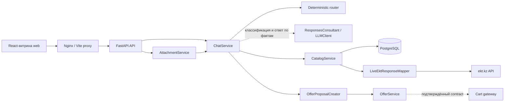
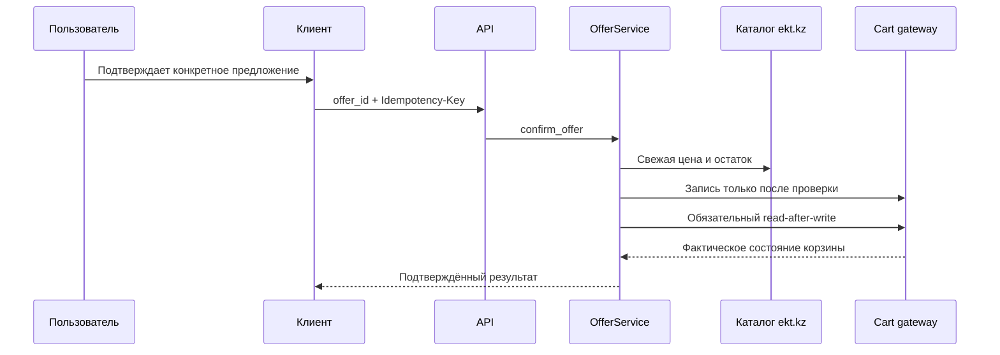

<div align="center">

# ekt.kz Product Assistant

### Безопасный MVP AI-ассистента для товарного каталога

<p>
  
  
  
  
</p>

<p>
  <a href="#быстрый-старт">Быстрый старт</a> ·
  <a href="#возможности">Возможности</a> ·
  <a href="#статус-интеграций">Статус интеграций</a> ·
  <a href="#документация">Документация</a>
</p>

</div>

> [!IMPORTANT]
> В `main` объединены витрина React, FastAPI, ИИ-консультант и реальный API каталога EKT. Это отдельный локальный прототип, а не установленный чат действующего ekt.kz. Реальная корзина, утверждённые правила аналогов и условия покупки пока недоступны. Сервер не подменяет реальный каталог демонстрационными данными; отдельный CLI и явно включаемый автономный режим витрины содержат демоданные.

## Что это такое

**ekt.kz Product Assistant** — витрина с чат-консультантом для поиска электротехнических товаров. Сервер получает товары, изображения, цены и остатки из EKT, а модель классифицирует запрос и формирует ответ по свежим фактам. Поиск, проверка данных и подтверждение предложения остаются в backend; модель не управляет корзиной.

В проект входят `web` (React/TypeScript/Vite), `app` (FastAPI/PostgreSQL) и общий ИИ-модуль `src/hack_4cfe9779_k14`. `ResponsesConsultant` использует общие схемы Query/Draft и инструкции CLI через асинхронный OpenAI Responses API; модель по умолчанию — `gpt-6-luna`.

[Витрина: запуск и контракт API](web/README.md) · [Отчёт о проверке интеграции](docs/backend-integration-report.md) · [Отдельный CLI](docs/consultant.md).

## Возможности

| | Возможность | Как это устроено |
| --- | --- | --- |
| 💬 | Сессионный диалог | История изолирована по chat session; follow-up вопрос использует только контекст своей сессии. |
| 🔎 | Каталог и поиск | Точный SKU имеет приоритет над текстовым поиском; индекс PostgreSQL поддерживает FTS и JSONB-характеристики. |
| 🧭 | Grounded-ответы | Модель получает свежие факты через `CatalogService`; ID товаров, источников и ссылки ответа проверяются сервером. |
| 📎 | Вложения | PDF, DOCX, XLSX, JPEG и PNG проходят проверку формата и извлечение данных; содержимое и извлечённые строки обрабатываются локально и не передаются модели. |
| 🛒 | Безопасный pending offer | Изменение корзины требует отдельного `offer_id`, явного подтверждения, свежей проверки и ключа идемпотентности. |
| 🔌 | Заменяемые интеграции | Catalog, LLM, cart, правила аналогов и условия покупки вынесены в независимые service/adapter boundaries. |

## Статус интеграций

| Компонент | Сейчас | Настройка / ограничение |
| --- | --- | --- |
| Витрина | 🟢 React-интерфейс с каталогом, поиском, чатом, файлами и предложениями. | Compose запускает `web` на порту 8080. |
| Каталог ekt.kz | 🟢 `LiveEktResponseMapper` и Basic Auth работают с реальными list/detail ответами. | Нужны `EKT_API_USERNAME` и `EKT_API_PASSWORD`; без них источник недоступен. |
| Поиск | 🟢 PostgreSQL-индекс, точный SKU, текстовый поиск, страницы каталога. | При старте по умолчанию пять страниц; поиск охватывает только загруженную часть. |
| ИИ | 🟢 Responses API: классификация и ответ по данным сервера. | Нужен `OPENAI_API_KEY`; модель задаёт `OPENAI_MODEL`. Прежний `LLM_API_*` адаптер остаётся альтернативой для классификации. |
| Корзина | 🔴 Создание предложения и его подтверждение реализованы. Настоящая корзина EKT пока не подключена. | Предоставлен API каталога, но нет подтверждённой документации и доступа для операций с корзиной посетителя. После их получения нужно реализовать и проверить подключение корзины. |
| Аналоги | 🟡 Алгоритм проверки совместимости реализован и протестирован. | Правила отключены до утверждения параметров взаимозаменяемости партнёром. |
| Условия покупки и сертификаты | 🔴 Утверждённые условия не предоставлены; сертификаты отсутствуют в проверенном API. | Нужны подтверждённые источники; отсутствующие сведения не выдумываются. |

<details>
<summary><strong>Почему это важно?</strong></summary>

Семантическое сходство не означает совместимость, а правдоподобный текст LLM не является данными каталога. Поэтому неизвестные сведения не заполняются предположениями: отсутствие поля, `null`, `0` и пустой список остаются различимыми во внутренней модели.

</details>

## Архитектура



Ключевая граница: `CatalogService` — единственная точка доступа к товарным данным для routes и чата. Внешний JSON не выходит за пределы adapter layer, а cached-поля не выдаются за актуальные цену, остатки или доступность.

## Быстрый старт

### Docker Compose — рекомендуемый путь

```bash
cp -n .env.example .env  # Не перезаписывайте уже заполненный файл.
# Заполните .env по таблице ниже, затем:
docker compose up -d --build
```

Нужны Docker Engine и Compose v2. Настройки задаются только в локальном `.env`:

| Переменная | Назначение |
| --- | --- |
| `POSTGRES_PASSWORD` | Пароль локальной БД; замените пример своим значением. |
| `EKT_API_USERNAME`, `EKT_API_PASSWORD` | Серверный Basic Auth каталога EKT. |
| `OPENAI_API_KEY` | Ключ для ИИ; не помещать в Git или `VITE_*`. |
| `OPENAI_MODEL` | По умолчанию `gpt-6-luna`. |
| `CATALOG_SYNC_PAGES` | Число страниц начального индекса; по умолчанию 5. |

С пустыми EKT-полями синхронизация пропускается, API запускается без доступного источника каталога. Без настроенной модели остаются детерминированные сценарии по артикулу и локальная обработка файлов. Неверные непустые credentials или недоступный EKT при начальной синхронизации могут остановить запуск API; проверьте конфигурацию и повторите запуск.

После старта:

| Сервис | Адрес |
| --- | --- |
| Витрина и чат | [http://127.0.0.1:8080](http://127.0.0.1:8080) |
| Swagger UI | [http://localhost:8000/docs](http://localhost:8000/docs) |
| Healthcheck | [http://localhost:8000/health](http://localhost:8000/health) |

```bash
curl http://localhost:8000/health
# {"status":"ok","database":"ok"}
```

Остановить контейнеры:

```bash
docker compose down
```

Для удаления локальных данных PostgreSQL используйте `docker compose down -v`.

> [!NOTE]
> Compose поднимает `db`, `api` и `web`. API применяет восемь Alembic-миграций и загружает начальные страницы каталога. Nginx проксирует `/api` и `/health` к FastAPI; порты привязаны к localhost. Для публичного размещения нужны аутентификация посетителей и защита административных API.

<details>
<summary><strong>Запуск без Docker</strong></summary>

Требуются Python 3.12, PostgreSQL 16, Node 22.18+ (рекомендуется 24) и Tesseract OCR для JPEG/PNG. Команды ниже — для Bash, из корня репозитория:

```bash
cp -n .env.example .env
# Задайте DATABASE_URL для своей БД и остальные настройки из таблицы выше.
python -m venv .venv
source .venv/bin/activate
pip install -r requirements.txt
alembic upgrade head
PYTHONPATH=src python -m app.catalog_sync
PYTHONPATH=src uvicorn app.main:app --host 127.0.0.1 --port 8000 --reload
```

В другом терминале:

```bash
npm ci --prefix web
npm run dev --prefix web
```

Откройте адрес, напечатанный Vite. `/api` и `/health` проксируются на `127.0.0.1:8000`. Для БД из Compose на хосте используется порт 55432; пароль в `DATABASE_URL` должен совпадать с `POSTGRES_PASSWORD`. В контейнере URL БД собирается автоматически из `POSTGRES_*`.

`PYTHONPATH=src` нужен для общего ИИ-модуля. Отдельный CLI запускается через `uv run --frozen ekt-consultant` после `uv sync --locked` и использует демокаталог или JSON-снимок, а не live EKT. `uv sync` может удалить зависимости FastAPI из общего `.venv`; после него повторите установку `requirements.txt`. Подробнее: [CLI](docs/consultant.md), [разработка витрины](web/README.md).

</details>

## Безопасность по умолчанию

Диаграмма описывает реализованный протокол для будущего подключения настоящей корзины. В предоставленных материалах есть API товаров, но нет подтверждённых методов чтения и изменения корзины, способа авторизации и привязки корзины к посетителю. Поэтому адаптер реальной корзины ещё не реализован: используется `UnavailableCartGateway`, а подтверждение возвращает `cart_unavailable`. Товар не добавляется, и интерфейс сообщает об этом явно.



- **LLM не получает tools, доступ к БД, ekt.kz, корзине или секретам.** Он возвращает классификацию и текст по переданным сервером фактам. Проверка ID/ссылок не гарантирует правильность каждой фразы; качество свободных ответов требует отдельной оценки.
- **Корзина не изменяется по текстовому «да».** Нужны конкретный `offer_id`, та же сессия, fresh validation и `Idempotency-Key`.
- **Внешние ошибки не раскрываются клиенту.** Все ожидаемые ошибки имеют форму `{ "code", "message" }`.
- **Credentials остаются на сервере.** `.env` игнорируется Git; Basic Auth, API keys, URL с секретами и request bodies не попадают в логи.
- **Вложения недоверенны.** Сервис проверяет размер, расширение, MIME и содержимое; извлечение, OCR и сопоставление позиций выполняются локально. Содержимое файлов и связанные с ними сообщения исключаются из контекста внешней модели.

Подробности: [security review](docs/security-review.md) · [контракт ошибок](docs/api-conventions.md) · [подтверждение корзины](docs/offer-confirmation-flow.md).

## API: краткая карта

Полная интерактивная спецификация доступна в [Swagger UI](http://localhost:8000/docs) после локального запуска.

| Область | Основные endpoints | Назначение |
| --- | --- | --- |
| Health | `GET /health` | Проверка доступности API и PostgreSQL. |
| Чат | `POST /api/chat/sessions`<br>`POST /api/chat/sessions/{id}/messages`<br>`GET /api/chat/sessions/{id}/messages` | Создание сессии, сообщение и история. |
| Каталог | `GET /api/catalog/status`<br>`GET /api/catalog/source-page?page=N`<br>`GET /api/catalog/products`<br>`GET /api/catalog/search`<br>`GET /api/catalog/products/{article}/fresh`<br>`GET /api/catalog/products/{article}/current` | Поиск и актуализация данных через каталоговый сервис. |
| Вложения | `POST /api/attachments`<br>`POST /api/chat/sessions/{id}/attachments` | Извлечение или session-scoped загрузка. |
| Offers | `POST /api/chat/sessions/{id}/offers`<br>`POST /api/chat/sessions/{id}/offers/{offer_id}/confirm` | Создание и безопасное подтверждение предложения. |

> [!WARNING]
> Каталог подключён к реальному EKT API при настроенных credentials. Доступ к каталогу не предоставляет доступ к корзине или админке EKT: запись в корзину остаётся недоступной.

## Подключение ekt.kz

Сервис не угадывает API партнёра. На данный момент документированы только следующие read-пути:

```text
GET /api/products?page=<number>
GET /api/products/detail?id=<partner-id>
```

`LiveEktResponseMapper` уже реализован по фактическим ответам API: сохраняет строковые артикулы, характеристики, изображения, ссылки, цену и остатки по складам. Неизвестные значения остаются неизвестными. Противоречия между названием и характеристиками не исправляются догадкой.

1. Задайте `EKT_API_USERNAME` и `EKT_API_PASSWORD` в `.env` только на сервере.
2. Запуск Compose загружает `CATALOG_SYNC_PAGES` страниц; просмотр следующих страниц витрины расширяет индекс. Для ручной загрузки: `docker compose exec api python -m app.catalog_sync`.
3. Для известного partner ID: `docker compose exec api python -m app.catalog_sync --product-id 515291`. Свежая карточка затем читается по сохранённому ID без повторного обхода всего каталога.
4. Для подключения корзины нужно получить от EKT документацию и доступ к её API: авторизацию, привязку к посетителю, методы чтения/добавления/изменения количества, правила повторных запросов и URL корзины. Затем необходимо реализовать адаптер и проверить фактическое добавление товара. Одного API каталога для этого недостаточно. Для аналогов и условий покупки нужны утверждённые правила и источники.

Подробнее: [интеграция ekt.kz](docs/ekt-integration.md) · [каталог и поиск](docs/catalog.md).

## Структура проекта

```text
.
├── app/
│   ├── api/routes/       # FastAPI endpoints
│   ├── config/           # settings, database, logging, reviewable config
│   ├── integrations/     # EKT, LLM и cart boundaries
│   ├── models/           # SQLAlchemy entities
│   ├── repositories/     # persistence queries
│   ├── schemas/          # Pydantic contracts
│   └── services/         # chat, catalog, offers, attachments, analogs
├── web/                  # React/TypeScript, Vite, Nginx, витрина и чат
├── src/hack_4cfe9779_k14/ # общий ИИ-модуль и самостоятельный CLI
├── alembic/              # database migrations
├── docs/                 # architecture and integration contracts
├── tests/                # unit and integration tests
├── docker-compose.yml
└── .env.example
```

## Ограничения текущей версии

- **Поиск — по частичному индексу.** По умолчанию загружены пять страниц (100 товаров в проверенном API); поиск возвращает до 100 результатов. Артикул вне загруженной части не находится. Поиск по характеристикам требует загруженных detail-карточек.
- **Файлы — до пяти по 10 МБ.** Поддержаны PDF/DOCX/XLSX/JPEG/PNG; старые DOC/XLS не поддержаны. PDF читается по текстовому слою: OCR сканированных PDF отсутствует, для OCR используйте JPEG/PNG. Ошибки OCR и неоднозначные количества требуют уточнения; надёжнее таблица «Артикул / Количество».
- **Корзина и совместимость ограничены.** Реальной записи в корзину нет. Без утверждённых правил аналоги не предлагаются. Количество целочисленное; дробные остатки источника отмечаются как неизвестные.
- **История восстанавливает текст.** После перезагрузки карточки и незавершённые предложения заново не восстанавливаются; session ID хранится в `sessionStorage` вкладки.
- **Демонстрационные режимы отдельные.** CLI содержит `demo_catalog.json`; автономный web-режим включается только явно через `VITE_ASSISTANT_API_BASE=demo`. Серверный режим не переключается на него при сбое API.

## Разработка и качество

```bash
# Автотесты backend (после установки requirements.txt)
.venv/bin/python -m pytest -q

# Тесты и production-сборка frontend (после npm ci --prefix web)
npm test --prefix web
npm run build --prefix web

# Проверка импорта/синтаксиса Python
python -m compileall -q app

# Применить миграции
alembic upgrade head

# Очистить временные данные (в production запускается scheduler платформы)
python -m app.maintenance
```

Проверка интеграции 23 сентября 2026 года: **119 backend-тестов, 2 frontend-теста и production-сборка прошли**. Проверены живые EKT/ИИ-ответы, страницы каталога, загрузки, изоляция сессий, предложения и идемпотентный отказ неподключённой корзины. Это результаты проверки кода перед обновлением документации; подробности — в [отчёте](docs/backend-integration-report.md).

`PendingOffer`, idempotency keys и нормализованные данные вложений имеют срок жизни. Команда maintenance удаляет истёкшие записи bounded batches; встроенный scheduler намеренно отсутствует.

Ключевые настройки и безопасные значения по умолчанию находятся в [`.env.example`](.env.example). Реальный `.env` не коммитится.

## Документация

| Тема | Документ |
| --- | --- |
| HTTP-формат и ошибки | [API conventions](docs/api-conventions.md) |
| Каталог, поиск и fresh data | [Catalog](docs/catalog.md) |
| Диалог и LLM isolation | [Chat flow](docs/chat-flow.md) |
| Аналоги и compatibility filters | [Analog replacements](docs/analog-replacements.md) |
| Pending offer и подтверждение | [Offer confirmation flow](docs/offer-confirmation-flow.md) |
| Загрузка и разбор файлов | [Attachments](docs/attachments.md) · [Chat attachments](docs/chat-attachments.md) |
| Условия покупки | [Purchase conditions](docs/purchase-conditions.md) |
| Витрина и её API | [Web README](web/README.md) |
| Общий ИИ-модуль и CLI | [Consultant](docs/consultant.md) |
| Результаты проверки интеграции | [Integration report](docs/backend-integration-report.md) |
| Контракт EKT | [EKT integration](docs/ekt-integration.md) |
| Безопасность | [Security review](docs/security-review.md) |

---

<div align="center">
  <sub>Витрина, FastAPI и ИИ объединены в main; реальный каталог подключён, корзина ожидает API партнёра.</sub>
</div>
