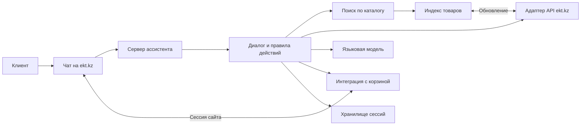
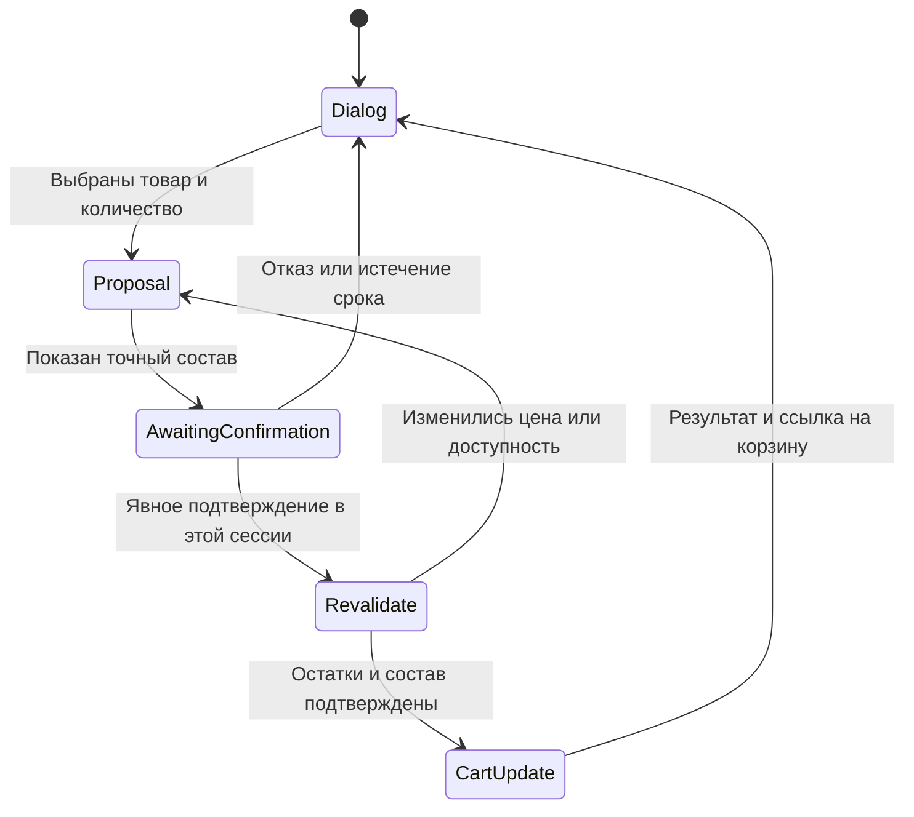

# Архитектура ИИ-ассистента для ekt.kz

Статус: проектное решение для MVP на основе двух PDF кейса HackAlem AI. Подтверждённые требования ниже отделены от решений реализации и неизвестных интеграций.

## Пользовательский путь

На страницах ekt.kz есть кнопка чата: панель на компьютере, полноэкранное окно на телефоне. Посетитель пишет свободным текстом или прикладывает фото товара, спецификацию, накладную в заявленных форматах Excel, Word, PDF, JPEG. В пределах сессии чат помнит контекст.

Стартовые подсказки: «Найти товар», «Проверить наличие», «Подобрать аналог», «Условия покупки». Ответ может содержать карточки товаров с артикулом, ключевыми характеристиками, актуальным наличием, сертификатом (если он есть в данных) и ссылкой на товар.

1. Клиент описывает товар, указывает артикул или загружает файл. При неоднозначности ассистент уточняет характеристики и количество.
2. Система ищет позиции в каталоге и перед ответом о цене/наличии получает свежие данные. Если позиции нет в наличии, предлагает совместимые аналоги с объяснением отличий.
3. Клиент просит добавить конкретные позиции. Ассистент показывает точный состав и количества, затем предлагает действие «Добавить в корзину».
4. Клиент явно подтверждает это предложение сообщением или кнопкой. Сервер повторно проверяет остаток и сессию, после чего добавляет товары.
5. Ассистент сообщает фактический результат и даёт прямую ссылку на актуальную корзину. При изменении доступного количества показывает новое предложение и запрашивает подтверждение снова.

Пример (артикул и числа условные): «Есть 10 штук X?» → «Доступно 6; аналог Y совпадает по сечению и числу жил, отличается материалом оболочки» → «Добавь 6 штук X» → «Добавить 6 штук X в корзину?» → «Да, добавь» → «Добавлено 6 штук X. Открыть корзину».

## Компоненты

| Компонент | Задача |
| --- | --- |
| Чат на сайте | Ввод текста и файлов, карточки товаров, подтверждение, ссылка на корзину; работа на компьютере и телефоне. |
| Сервер ассистента | Принимает запросы, защищает API и связывает действия с сессией посетителя. |
| Диалог и правила действий | Определяет намерение, вызывает разрешённые функции, хранит ожидающее подтверждение. Только здесь разрешается изменение корзины. |
| Языковая модель | Разбирает свободный текст/извлечённое содержимое и формулирует ответ. Не является источником цен, остатков или сертификатов. |
| Адаптер каталога | Читает страницы `/api/products` и детали `/api/products/detail?id=...`, нормализует данные и ошибки. Basic Auth используется только на сервере. |
| Индекс товаров | Быстро находит артикулы и кандидатов в аналоги. Цена и остаток перед ответом сверяются с первичным API. |
| Интеграция с корзиной | Меняет корзину текущего посетителя через механизм сайта, учитывает остаток и защищает от повторного добавления при сетевом повторе. Механизм не описан в PDF. |
| Хранилище сессий | Контекст диалога, подготовленные предложения, время их действия и ключи идемпотентности. |

Для MVP предлагаем встраиваемый виджет на TypeScript/React и сервер на Python/FastAPI. Это технический выбор, не требование кейса. Начальный индекс можно реализовать в PostgreSQL с полнотекстовым поиском и фильтрами по характеристикам. Отдельная векторная база не обязательна. Поставщик языковой модели выбирается после оценки скорости, стоимости и правил обработки данных.

### Контракт виджета и сервера

| Запрос | Назначение и ответ |
| --- | --- |
| `POST /assistant/messages` | Сообщение и идентификаторы загруженных вложений. Ответ: текст, карточки товаров, уточняющий вопрос или предложение с `proposal_id`. |
| `POST /assistant/attachments` | Загрузка разрешённого файла. Ответ: временный идентификатор и результат проверки формата. |
| `POST /assistant/proposals/{id}/confirm` | Явное подтверждение конкретного предложения. Ответ: фактически добавленные позиции, ошибки по позициям и ссылка на корзину после успешной записи. |

Сессия передаётся через защищённый механизм сайта; её идентификатор не принимается из текста сообщения. Для запросов, меняющих корзину, нужны защита от подделки запроса и серверная проверка прав текущей сессии. Кнопка подтверждения вызывает отдельный endpoint; текстовое «да, добавь» проходит ту же серверную проверку ожидающего предложения. Долгую обработку файла можно вынести в фоновую задачу, показывая статус в чате. Путь для обычного текстового ответа проектируется на задержку в единицы секунд, как требует кейс.

## Защита действия с корзиной

- Подтверждение привязано сервером к конкретному предложению: идентификаторам товаров, количеству и сессии. Общее «да» вне состояния ожидания ничего не меняет.
- Перед записью сервер повторно проверяет доступность. Количество не превышает остаток. Успех показывается только после подтверждения нового состояния корзины сайтом.
- Ключ идемпотентности не позволяет сетевому повтору добавить товар дважды.
- Цена и наличие берутся из каталога. Если поле отсутствует или API недоступен, ассистент прямо сообщает, что подтвердить значение сейчас нельзя.
- Оплата, доставка и минимальная партия описываются только по утверждённому источнику сайта/партнёра; этот источник в PDF не предоставлен.
- Содержимое файлов и карточек рассматривается как данные, а не как команды для ассистента.

## Данные и интеграции

Приложение с данными подтверждает Basic Auth, каталог `/api/products`, пагинацию через `?page=2` и карточку `/api/products/detail?id=...`. Формат ответов, список доступных полей, ограничения API и способ работы с корзиной не описаны.

Предполагаемая внутренняя модель товара: `id`, `article`, `name`, `category`, `attributes`, `certificate_links`, `price`, `warehouse_stocks`, `availability`, `product_url`, `updated_at`. Наличие каждого поля нужно сверить с реальным API. Для аналогов нужны правила совместимости по категориям и характеристикам; одного сходства названий недостаточно.

Сервер загружает страницы каталога в индекс, запрашивает детали выбранного товара, а цену и остаток перепроверяет при ответе и перед корзиной. Для большого каталога потребуется согласованный с партнёром график или инкрементальное обновление.

Файлы принимаются в указанных форматах с ограничением размера и проверкой типа содержимого. Сервер извлекает текст и таблицы; из фото пытается прочитать артикул/маркировку. При низкой уверенности уточняет у клиента. Платёжные данные не запрашиваются и не сохраняются.

## Что понадобится от ekt.kz

| Материал или доступ | Для чего |
| --- | --- |
| Документация и образцы ответов API каталога | Проверить поля, характеристики, цены, остатки, сертификаты и пагинацию. |
| Тестовый механизм корзины и её адрес | Добавлять товары текущему посетителю и открывать актуальную корзину. |
| Способ передачи сессии сайта в чат | Связать подтверждение и корзину одного клиента. |
| Утверждённые условия покупки | Отвечать про оплату, доставку и минимальную партию без догадок. |
| Правила технической совместимости аналогов | Исключить неподходящие замены. |
| Политика хранения файлов и диалогов | Определить срок удаления и допустимую передачу данных модели. |
| Лимиты API и тестовая среда | Настроить обновление индекса и проверку корзины. |

Учётные данные из PDF нельзя помещать в браузер, репозиторий и логи. Сервер получает их из переменных окружения или менеджера секретов. Перед использованием в рабочей среде партнёру следует заменить опубликованные в приложении данные доступа.

## Порядок создания MVP

1. Уточнить API каталога и корзины, условия покупки и правила аналогов.
2. Сделать адаптер каталога и поиск по артикулу/характеристикам.
3. Подключить чат и ответы по проверенным данным с контекстом сессии.
4. Добавить аналоги с кратким объяснением совпадений и отличий.
5. Подключить подтверждение, повторную проверку и запись в корзину.
6. Подключить вложения, адаптивный интерфейс и контроль времени ответа в пределах нескольких секунд.

Приёмка соответствует пяти обязательным требованиям PDF: верный ответ по существующему артикулу и сертификату при его наличии; хотя бы один обоснованный аналог отсутствующего товара; содержательный ответ об условиях покупки; отсутствие записи в корзину без явного подтверждения и ограничение количеством на складе; прямая ссылка на обновлённую корзину. Казахский язык, сопутствующие товары, постоянная история и передача менеджеру — опции следующего этапа.
