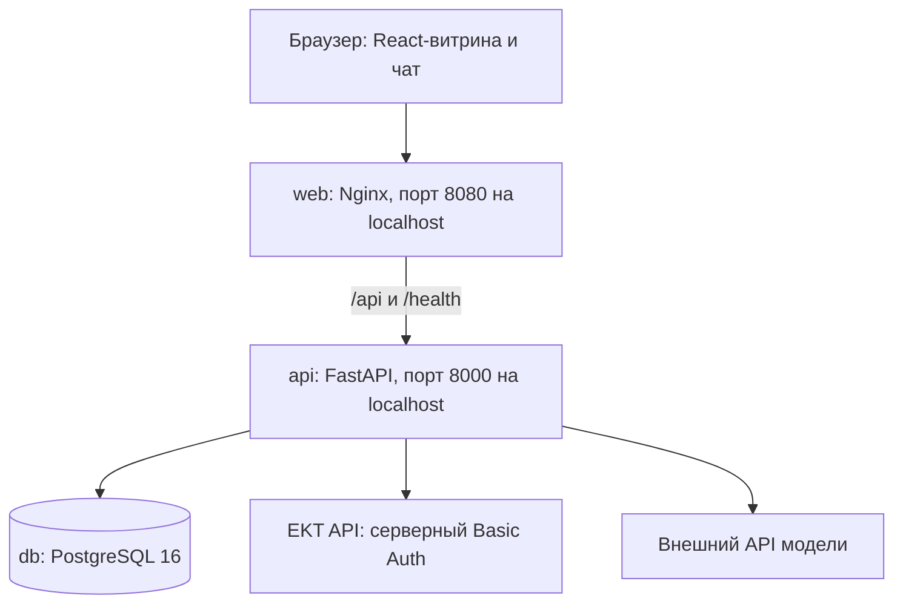
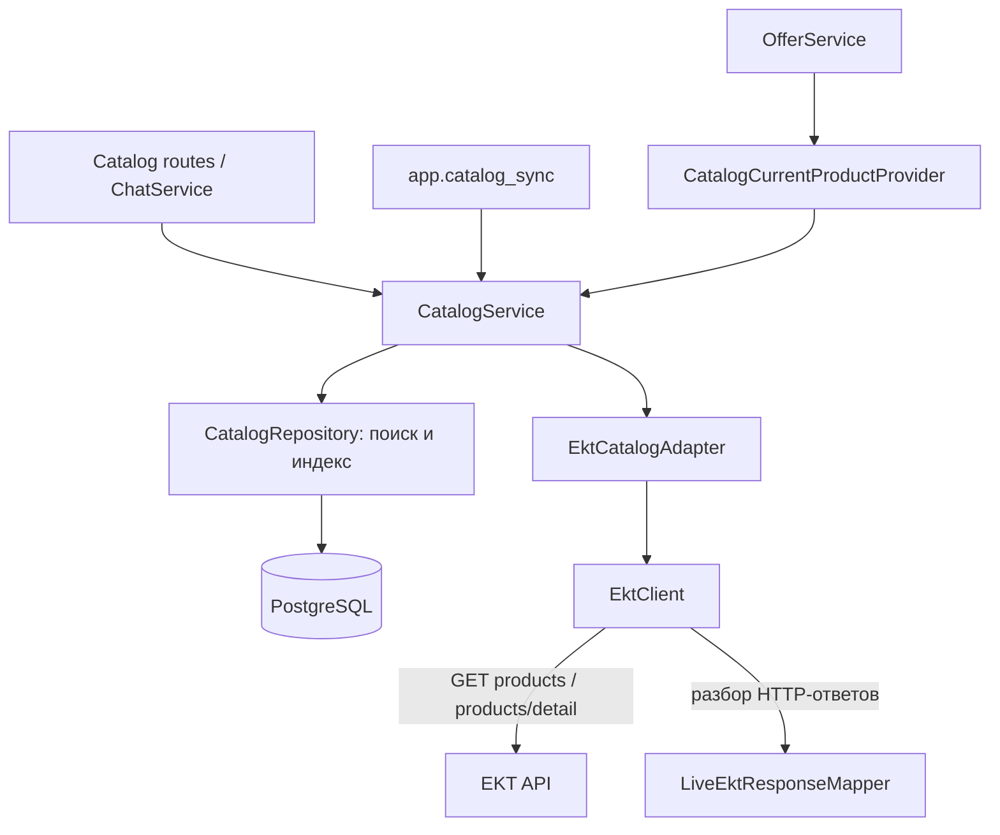
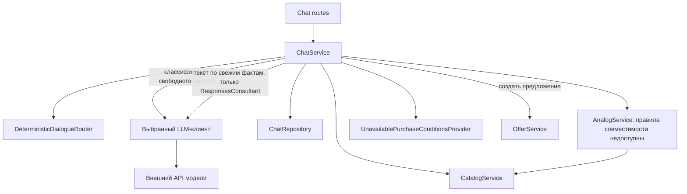

# Архитектура ИИ-ассистента для ekt.kz

Документ описывает текущий код, а не целевую архитектуру кейса. Приложение — отдельная демонстрационная React-витрина с реальным каталогом EKT при настроенном доступе. В действующий ekt.kz чат не встроен; настоящая корзина не подключена.

## Развёртывание

Compose запускает три контейнера: `web`, `api`, `db`. Перед запуском Uvicorn контейнер API выполняет Alembic-миграции и `app.catalog_sync`. В разработке Vite заменяет Nginx и проксирует `/api` и `/health` на локальный FastAPI. Отдельных очереди, worker, векторной БД или контейнера ИИ нет.

## Каталог и хранение

`LiveEktResponseMapper` преобразует JSON EKT в `EktProduct`; `EktCatalogAdapter` нормализует его в `CatalogProductUpsert`. Mapper сам HTTP-запросы не выполняет. Без EKT credentials выбирается `UnavailableCatalogAdapter`, синтетический каталог в серверное приложение не подставляется.

Начальная синхронизация загружает `CATALOG_SYNC_PAGES` страниц (по умолчанию пять); просмотр страниц расширяет индекс. Поиск ограничен индексированной частью ассортимента. `/fresh` и `/current` обращаются к источнику; cached-поля индекса не используются как подтверждение актуальных цены и остатков. Сертификаты текущий live mapper не извлекает. Дробные остатки не округляются: они становятся неизвестными при текущем целочисленном контракте.

Доступ к PostgreSQL идёт через SQLAlchemy repositories:

| Репозиторий | Данные |
| --- | --- |
| `CatalogRepository` | Индекс товаров, характеристики, метаданные источника. |
| `ChatRepository` | Сессии, сообщения и контекст выбранного товара. |
| `ChatAttachmentRepository` | Нормализованные результаты извлечения, принадлежность сессии и срок хранения. |
| `OfferRepository` | Предложения, статусы и результаты идемпотентных подтверждений. |
| `MaintenanceRepository` | Удаление истёкших временных записей командой `app.maintenance`; встроенного планировщика нет. |

## Диалог и ИИ

1. Routes собирают зависимости `ChatService`; сервис читает историю своей сессии и сохраняет сообщение.
2. Простые запросы обрабатывает детерминированный роутер. Для свободных запросов используется LLM; поиск по требованиям при подключённом `ResponsesConsultant` также передаётся модели.
3. Каталог, условия покупки и предложения обрабатываются серверными сервисами. `AnalogService` по умолчанию использует `UnavailableCompatibilityRules`, поэтому аналогов нет. Provider условий покупки возвращает отсутствие утверждённых данных.
4. `ResponsesConsultant` может сформулировать ответ по свежим фактам каталога. Сервер проверяет ID товаров, источников и URL; это не доказательство правильности каждой фразы. Решения о корзине и уточнения модель не переписывает.

При `OPENAI_API_KEY` выбирается `ResponsesConsultant`, использующий общие схемы и инструкции из `src/hack_4cfe9779_k14/consultant.py` и OpenAI Responses API. Если ключ отсутствует, используется `OpenAICompatibleLLMClient` при заполненных `LLM_API_URL`, `LLM_API_KEY`, `LLM_MODEL`; он классифицирует запросы без метода `compose`. Без конфигурации выбирается `UnavailableLLMClient`.

Модель не имеет tools, прямого доступа к каталогу, БД или корзине. История ограничена настройкой `LLM_HISTORY_MESSAGE_LIMIT`. Отдельный CLI-консультант использует собственный демокаталог или JSON-снимок; это не источник товаров web/API.

## Вложения

Загрузка файла не вызывает `ChatService` напрямую. Витрина выполняет два запроса:

1. `POST /api/chat/sessions/{session_id}/attachments`: route проверяет сессию, читает файл с лимитом, вызывает `AttachmentService` и сохраняет извлечённый результат через `ChatAttachmentRepository`.
2. `POST /api/chat/sessions/{session_id}/messages` с `attachment_ids`: `ChatService` проверяет принадлежность вложений, читает сохранённые результаты и вызывает локальный `AttachmentItemParser`; найденные позиции сопоставляются через `CatalogService`.

Поддерживаются PDF с текстовым слоем, DOCX, XLSX, JPEG/PNG; изображения обрабатываются Tesseract OCR. Есть проверки расширения, MIME, содержимого и размера. OCR сканированных PDF и распознавание товара по внешнему виду не реализованы. Бинарные файлы не сохраняются; извлечённые данные имеют срок хранения. Содержимое вложений и сообщения, связанные с ними, исключаются из контекста внешней модели.

## Предложения и корзина

`OfferProposalCreator` — Python Protocol, описывающий создание предложения, а не отдельный процесс или этап запроса. Его реализует `OfferService`: экземпляр передаётся в чат через FastAPI dependency injection. Тот же сервис вызывают offers routes.

- Создание предложения: чат или `POST /api/chat/sessions/{session_id}/offers` → `OfferService` → `CatalogCurrentProductProvider` → свежий `CatalogService` → сохранение предложения в БД.
- Подтверждение: кнопка «Да, добавить» → `POST /api/chat/sessions/{session_id}/offers/{offer_id}/confirm` с `Idempotency-Key` → блокировка предложения, проверка сессии, срока действия и повторного запроса → повторная проверка товара, цены и остатков.
- При изменении цены создаётся новое предложение; недостаточный остаток приводит к отказу. Текстовое «да» серверное предложение не подтверждает.
- При успешных проверках вызывается `UnavailableCartGateway.resolve_cart`, который возвращает ошибку. Ответ содержит `cart_unavailable`, `cart_url=null`; товар не добавляется. Код записи и проверки состояния корзины подготовлен в `OfferService`, но с текущим gateway не достигается.

Для транзакций предложений и чтения каталога используются разные DB-сессии. Корзина EKT потребует отдельного контракта: идентификация владельца, чтение, изменение, идемпотентность и адрес актуальной корзины.

## Реальные маршруты витрины

| Назначение | Endpoint |
| --- | --- |
| Сессия и история | `POST /api/chat/sessions`, `GET /api/chat/sessions/{session_id}/messages` |
| Сообщение и загрузка | `POST /api/chat/sessions/{session_id}/messages`, `POST /api/chat/sessions/{session_id}/attachments` |
| Каталог и поиск | `GET /api/catalog/status`, `GET /api/catalog/source-page`, `GET /api/catalog/search` |
| Актуальный товар | `GET /api/catalog/products/{article}/fresh`, `GET /api/catalog/products/{article}/current` |
| Предложение и подтверждение | `POST /api/chat/sessions/{session_id}/offers`, `POST /api/chat/sessions/{session_id}/offers/{offer_id}/confirm` |

`session_id` хранится в `sessionStorage` вкладки. Аутентифицированная привязка к посетителю ekt.kz и защита административных API ещё не реализованы. История восстанавливает текст сообщений, но не карточки и ожидающие предложения. Compose доступен на localhost; публичный HTTPS и внедрение на сайт не входят в текущую конфигурацию. Задержка ответа в единицы секунд требует отдельных замеров.

## Исходники

- [Витрина и API-клиент](../web/src/main.tsx), [клиентские запросы](../web/src/api.ts), [Compose](../docker-compose.yml).
- [Сборка ChatService](../app/api/routes/chat.py), [диалог](../app/services/chat.py), [ResponsesConsultant](../app/integrations/responses_consultant.py).
- [Каталог](../app/services/catalog.py), [адаптер](../app/integrations/catalog_adapter.py), [EktClient](../app/integrations/ekt_client.py), [mapper](../app/integrations/ekt_mapper.py).
- [Загрузка вложений](../app/api/routes/chat_attachments.py), [извлечение](../app/services/attachments.py), [локальный parser](../app/services/attachment_parser.py).
- [Сборка OfferService](../app/api/routes/offers.py), [предложения](../app/services/offers.py), [gateway корзины](../app/integrations/cart_gateway.py).
