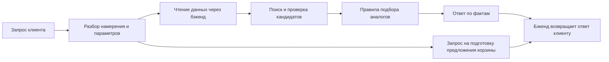

# Как разработать ИИ-часть ассистента ekt.kz

Текущее начало реализации: [самостоятельный консультант на gpt-6-luna](consultant.md). Модель выбрана пользователем; текстовые запросы работают через Responses API и локальный каталог. Остальные разделы ниже описывают план полного решения, а не уже выполненную интеграцию.

Этот план адресован команде, отвечающей за модель. Python-бэкенд, доступ к каталогу, сессии и корзину делает другой участник. Наша цель — модуль, который понимает запрос клиента, запрашивает нужные факты, подбирает объяснимые аналоги и отвечает по проверенным данным. Для MVP берём готовую языковую модель; обучение базовой модели с нуля не требуется.

Основа требований: PDF «HackAlem AI_ ИИ-ассистент для чата на сайте ekt.kz.pdf» и «ИИ-ассистент для чата на сайте ekt.kz ДАННЫЕ.docx.pdf». Из второго PDF известны только способ доступа и URL каталога; формат ответа API ещё нужно выяснить. Исходные материалы не описывают интерфейс корзины и источник условий покупки.

## 1. Что именно делает ИИ-часть

Модель помогает с языком и неоднозначностью. Идентификатор товара, цена, наличие, сертификат и условия покупки должны приходить из источников данных. Подтверждение и запись в корзину проверяет бэкенд независимо от текста ответа модели. Такой подход соответствует задаче ответа с привлечением внешних знаний, описанной в [работе о RAG](https://arxiv.org/abs/2005.11401).

### Граница ответственности

| Наша часть | Бэкенд сокомандника |
| --- | --- |
| Схема намерений и извлечение артикула, количества, характеристик, ограничений. | HTTP API, Basic Auth к каталогу, получение и обновление данных. |
| Стратегия поиска, правила аналогов, ранжирование кандидатов. | Сессия клиента, загрузка/хранение файлов, доступ к корзине. |
| Промпты, формат структурированного результата, формулировка ответа. | Проверка прав, подтверждения, остатков и фактическая запись в корзину. |
| Набор сценариев оценки, метрики качества и анализ ошибок. | Развёртывание, лимиты запросов, мониторинг сервиса. |

Обработку файлов делим по границе: бэкенд проверяет тип и размер, хранит файл и извлекает текст/OCR; наш модуль превращает извлечённый текст в перечень возможных товаров и количеств. Если команда выберет другой раздел ответственности, фиксируем его до реализации.

## 2. Этапы проектирования

### Этап 1. Зафиксировать контракт с бэкендом

Вместе с сокомандником согласовать три входа для ИИ-модуля: сообщение и историю текущей сессии; результат поиска/карточки товара; извлечённый текст вложения с указанием страницы или строки. Согласовать, кто вызывает модель и сколько раз на один запрос. Для MVP достаточно двух логических вызовов: разобрать запрос, затем сформировать ответ после получения фактов. Точные HTTP-маршруты может выбрать бэкенд.

**Результат:** версия JSON-схем и 3–5 примеров обмена для вопросов о товаре, отсутствии, условиях покупки, вложении и просьбе добавить в корзину.

### Этап 2. Собрать набор данных и эталоны

Нужны примеры доступных и отсутствующих товаров, карточки с характеристиками и сертификатами, цены и остатки, документы об оплате/доставке/минимальной партии, а также реальные или синтетические запросы клиентов. По каждой проверочной истории записать ожидаемый артикул, намерение, количество, допустимые аналоги и факты, которые разрешено сообщить. Синтетические данные допустимы для прототипа по кейсу, но должны сохранять структуру полей.

**Результат:** небольшой каталог для разработки, размеченные диалоги и список полей, которых пока нет в API. Не добавлять в набор платёжные данные клиента и секреты каталога.

### Этап 3. Выбрать базовую модель на практике

Сравнить 2–3 доступные модели на одинаковых сценариях: русский текст, извлечение артикула и количества, вопросы с опечатками, короткие диалоги, ответы по заданным фактам. Оценивать качество, задержку и стоимость одного диалога. Поддержка казахского языка указана в кейсе как опция; её проверять отдельно. Провайдера выбрать после выяснения правил передачи клиентских данных.

**Результат:** одна основная модель, одна запасная конфигурация и зафиксированные параметры вызова. До этой проверки нет оснований оплачивать дообучение.

### Этап 4. Реализовать понимание запроса

Модель возвращает структурированный объект: `intent`, `article`, `name_query`, `category`, `attributes`, `quantity`, `language`, `missing_fields`, `requested_action`. Возможные намерения: `product_info`, `availability`, `alternatives`, `purchase_terms`, `cart_request`, `clarification`. Результат проверяется схемой; неизвестный артикул или количество остаётся пустым, а клиенту задаётся уточняющий вопрос.

Пример: «Нужны 5 автоматов на 16 А, есть ли в наличии?» → намерение `availability`, категория «автоматический выключатель», ток 16 А, количество 5. Модель не должна сама решать, какой товар имеется в виду, если совпадают несколько моделей.

**Результат:** разбор свободных фраз и диалога с явными неизвестными полями; невалидный JSON не попадает в поиск или корзину.

### Этап 5. Связать модель с каталогом

Порядок поиска: точное совпадение артикула → нормализация обозначений и поиск по названию → фильтры по категории и характеристикам → уточнение у клиента при нескольких похожих вариантах. Бэкенд отдаёт модели только ограниченное число карточек с идентификаторами и временем получения. Наличие и цену перепроверяют в первичном API перед ответом. Для MVP достаточно обычного поиска по артикулу и тексту; семантический индекс добавлять после оценки ошибок поиска.

**Результат:** каждый названный в ответе товар имеет реальный `product_id` и источник фактов. Если данных нет, ответ сообщает об ограничении.

### Этап 6. Сделать подбор аналогов

Сначала эксперт по ассортименту определяет для каждой категории обязательные признаки совместимости: например, назначение, напряжение, ток, размер, способ монтажа. Затем код отбрасывает несовместимые позиции; оставшиеся ранжируются по совпадающим параметрам и наличию. Модель объясняет, какие признаки совпали и чем варианты отличаются. Если критичный признак неизвестен, ассистент уточняет его либо честно говорит, что подтвердить замену нельзя.

**Результат:** аналог имеет проверяемую причину рекомендации. Похожее название само по себе не считается основанием.

### Этап 7. Сформировать ответ и диалог

Шаблон ответа получает запрос, найденные карточки, допустимые аналоги и утверждённые условия покупки. Он может использовать только эти сведения для конкретных цен, остатков и сертификатов. У ответа есть структура: короткий прямой вывод, детали товара или различия аналогов, уточнение/следующее действие. История ограничена текущей сессией; длинный разговор сокращается до фактов и незавершённого вопроса.

**Результат:** ответы понятны покупателю, корректно ссылаются на товар и не придумывают отсутствующие поля. Если нет утверждённого текста об условиях покупки, вопрос передаётся менеджеру или отмечается как требующий уточнения.

### Этап 8. Разобрать вложения

Из Excel/Word/PDF извлечь строки спецификации: возможный артикул, наименование, характеристики, количество и место в исходном файле. Из JPEG/сканов извлечь маркировку OCR. Модель связывает строки с каталогом, показывает найденные и неоднозначные позиции клиенту. Низкая уверенность распознавания требует вопроса клиенту. Документ не может содержать инструкции для изменения правил ассистента: его текст рассматривается как данные. [OWASP](https://genai.owasp.org/llm-top-10/) относит внедрение инструкций через внешние данные к рискам LLM-приложений.

**Результат:** загруженная спецификация превращается в проверяемый список кандидатов без автоматического изменения корзины.

### Этап 9. Проверить сценарии и доработать ошибки

Собрать минимум по несколько примеров каждого обязательного сценария и отрицательных случаев: неверный артикул, нулевой остаток, отсутствие сертификата, противоречивые характеристики, неизвестные условия покупки, «да» без предложения корзины, поддельная инструкция в файле. Разделить ошибки на поиск, извлечение параметров, правила аналогов и формулировку ответа. Исправлять тот компонент, который дал ошибку; дообучение рассматривать лишь после накопления устойчивых ошибок, которые не решаются схемой, правилами или данными.

**Результат:** таблица результатов на фиксированном наборе случаев и список оставшихся ограничений. Выполнены все пять обязательных проверок PDF.

### Этап 10. Подключить к рабочему потоку

Зафиксировать версии модели, промпта и правил аналогов; измерять задержку и стоимость, собирать обезличенные типы ошибок. При недоступности модели или каталога отдавать понятный ответ без выдуманных сведений и без действий с корзиной. Изменения промпта и модели повторно проверять на том же наборе сценариев.

**Результат:** воспроизводимая конфигурация ИИ-модуля, которую бэкенд может вызывать и безопасно обновлять.

## 3. Правило для корзины

Модель может вернуть `requested_action = cart_request` и распознанные `product_id`/`quantity`. Бэкенд строит точное предложение, привязывает его к сессии и показывает клиенту. После явного подтверждения бэкенд повторно проверяет остаток, изменяет корзину и возвращает результат. Модель не получает прямой функции записи в корзину. Ответ «да» вне ожидающего предложения не запускает действие.

## 4. Критерии качества нашей части

| Что измерять | Как проверить |
| --- | --- |
| Извлечение запроса | Сравнить намерение, артикул, характеристики и количество с разметкой. |
| Поиск | Проверить, входит ли нужный товар в первые результаты и распознаётся ли точный артикул. |
| Достоверность | Сверить каждую цену, остаток, характеристику и сертификат в ответе с переданными данными. |
| Аналоги | Проверить обязательные признаки совместимости и понятность объяснения. |
| Корзина | Подтвердить ноль изменений без явного согласия; проверку выполняет и бэкенд. |
| Файлы | Сравнить извлечённые артикулы/количества с исходными строками и отметить неоднозначные. |
| Скорость | Измерить полное время ответа для текстового запроса и отдельно для файла; кейс требует единицы секунд для ответа. |

## 5. Что запросить у сокомандника и партнёра сейчас

1. От бэкенда: черновик JSON-схем каталога, формат сессии, кто выполняет поиск и какие функции доступны ИИ-модулю.
2. От ekt.kz: реальные карточки разных категорий, правила аналогов, источник условий покупки, тестовые сценарии и несколько типичных спецификаций/фото.
3. От команды: доступный провайдер модели, бюджет на запросы, правила передачи клиентских файлов и критерии успешной демонстрации.

Первый практический шаг после этих договорённостей — сделать 15–20 размеченных запросов и простой конвейер «разбор запроса → поиск в каталоге → ответ по карточкам». Он даст измеримый базовый результат до работы с аналогами, файлами и корзиной.
